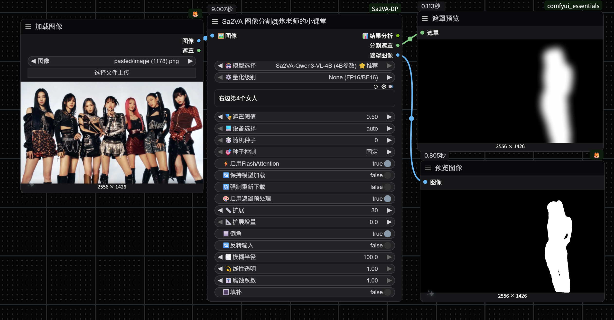

# ComfyUI-Sa2VA-DP

ComfyUI自定义节点，集成ByteDance Sa2VA模型，实现智能图像分割和视觉理解。

## ✨ 主要特点【更加听话，更加智能的语义分割】

- 🤖 **中文界面** - 参数名称和提示全中文，易于使用
- 📦 **自动管理** - 模型自动下载，智能缓存，断点续传
- ⚡ **性能优化** - 支持4bit量化、Flash Attention加速
- 🎨 **遮罩预处理** - 内置9种遮罩处理功能（扩展、模糊、填补等）
- 🎲 **种子控制** - 支持固定、随机、递增三种模式
- 💾 **灵活配置** - 设备选择、模型保持、量化级别可调

## ✨ 功能展示


## 📥 安装方法

### 方法1：ComfyUI Manager（推荐）

1. 打开ComfyUI Manager
2. 搜索 `Sa2VA`
3. 点击安装

### 方法2：Git克隆

```bash
cd ComfyUI/custom_nodes/
git clone https://github.com/your-repo/ComfyUI-Sa2VA-DP.git
cd ComfyUI-Sa2VA-DP
pip install -r requirements.txt
```

### 方法3：手动安装

1. 下载本项目并解压到 `ComfyUI/custom_nodes/ComfyUI-Sa2VA-DP`
2. 安装依赖：
```bash
pip install -r requirements.txt
```

### 可选依赖（推荐）

```bash
# 4bit量化支持（节省75%显存）
pip install bitsandbytes

# Flash Attention加速
pip install flash-attn

# Qwen模型支持
pip install qwen-vl-utils
```

## 🚀 快速开始

1. **重启ComfyUI**
2. **添加节点**：在节点菜单找到 `🤖大炮-Sa2VA` → `Sa2VA 图像分割@炮老师的小课堂`
3. **连接图像**：将图像输入连接到节点
4. **选择模型**：推荐使用 `Sa2VA-Qwen3-VL-4B (4B参数) ⭐推荐`
5. **运行**：首次运行会自动下载模型

## 📦 模型下载与存储

### 自动下载

首次使用时，模型会自动下载到：
```
ComfyUI/models/Sa2VA/
├── Sa2VA-Qwen3-VL-4B/
├── Sa2VA-InternVL3-2B/
├── Sa2VA-4B/
└── ...
```

### 支持的模型

| 模型 | 参数量 | 显存需求 | 推荐场景 |
|------|--------|---------|---------|
| **Sa2VA-Qwen3-VL-4B** ⭐ | 4B | ~10GB | 推荐使用 |
| Sa2VA-InternVL3-2B | 2B | ~6GB | 快速测试 |
| Sa2VA-4B | 4B | ~10GB | 平衡性能 |
| Sa2VA-8B | 8B | ~18GB | 高质量 |
| Sa2VA-InternVL3-8B | 8B | ~18GB | 高质量 |
| Sa2VA-InternVL3-14B | 14B | ~30GB | 超高质量 |
| Sa2VA-Qwen2.5-VL-3B | 3B | ~8GB | 轻量级 |
| Sa2VA-Qwen2.5-VL-7B | 7B | ~16GB | 高质量 |
| Sa2VA-1B | 1B | ~4GB | 最小显存 |
| Sa2VA-26B | 26B | ~50GB | 最高质量 |

### 手动下载（可选）

如果自动下载失败，可以手动下载模型到上述路径：

```bash
# 使用huggingface-cli
huggingface-cli download ByteDance/Sa2VA-Qwen3-VL-4B --local-dir ComfyUI/models/Sa2VA/Sa2VA-Qwen3-VL-4B
```
## 🔧 最新更新 (v1.0.3)

### 🛠️ 核心优化

**全面采用 ComfyUI 原生路径管理**：

1. ✅ **引入 `folder_paths` 模块** - 替换原有的路径自动检测逻辑，与 ComfyUI 核心保持一致
2. ✅ **更强的兼容性** - 完美适配 Windows/Linux/Mac 系统
3. ✅ **标准模型路径** - 模型统一存储在 `ComfyUI/models/Sa2VA`，符合 ComfyUI 规范
4. ✅ **代码精简** - 移除了冗余的路径查找代码，运行更稳定

### 🐛 历史更新 (v1.0.2)

**修复了致命的路径问题**：

1. ✅ **移除硬编码路径** - 不再依赖特定的 `E:/Comfyui_test/ComfyUI` 路径
2. ✅ **自动检测ComfyUI根目录** - 自动适配任何用户的安装路径
3. ✅ **支持所有盘符** - 支持C盘、D盘、E盘等任意盘符
4. ✅ **友好的路径显示** - 使用相对路径显示，不暴露完整路径
5. ✅ **更好的错误提示** - 提供清晰的错误信息和解决方案

**影响**：
- 修复前：只能在开发者电脑上运行，其他用户会遇到 `[WinError 3] 系统找不到指定的路径。: 'E:\\'` 错误
- 修复后：可以在任何用户的ComfyUI安装中正常工作

详细修复说明请查看 [BUG修复说明.md](BUG修复说明.md)

### 📞 联系方式 📞
- 作者：@炮老师的小课堂
- 版本：v1.0.2
- 更新日期：2025年
- 作者微信：paolaoshiAICG


**炮老师的小课堂** 出品 🎓
# ComfyUI-Sa2VA-DP
